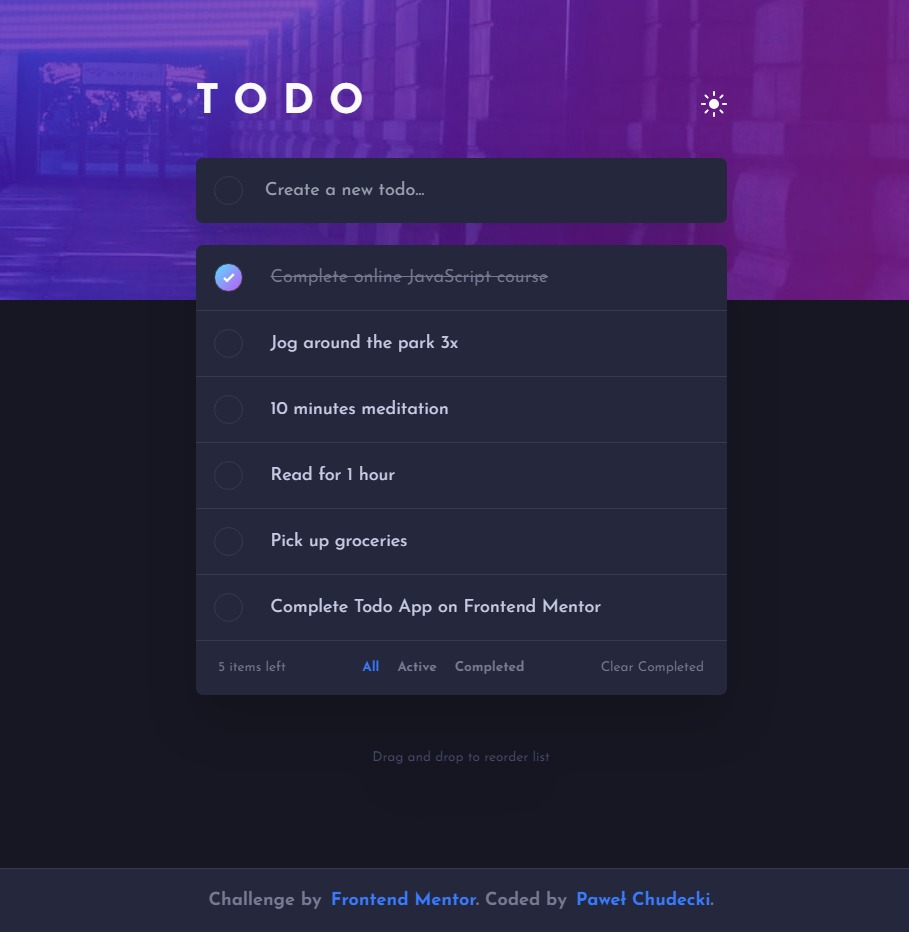

# Frontend Mentor - Todo app solution

This is a solution to the [Todo app challenge on Frontend Mentor](https://www.frontendmentor.io/challenges/todo-app-Su1_KokOW). Frontend Mentor challenges help you improve your coding skills by building realistic projects.

## Table of contents

- [The challenge](#the-challenge)
- [Screenshot](#screenshot)
- [Links](#links)
- [Built with](#built-with)
- [What I learned](#what-i-learned)
- [Useful resources](#useful-resources)
- [Author](#author)

### The challenge

Users should be able to:

- View the optimal layout for the app depending on their device's screen size
- See hover states for all interactive elements on the page
- Add new todos to the list
- Mark todos as complete
- Delete todos from the list
- Filter by all/active/complete todos
- Clear all completed todos
- Toggle light and dark mode
- **Bonus**: Drag and drop to reorder items on the list
  
My extra bonus:

- Edit todos on the list
- Save todos in browser Local Storage

### Screenshot

### Links

- Solution URL: [https://www.frontendmentor.io/solutions/todo-app-_R0-QfV8DB](https://www.frontendmentor.io/solutions/todo-app-_R0-QfV8DB)
- Live Site URL: [https://soulrvr29.github.io/Todo-app/](https://soulrvr29.github.io/Todo-app/)

### Built with

- Semantic HTML5 markup
- CSS custom properties
- Flexbox
- CSS Grid
- Mobile-first workflow
- [React](https://reactjs.org/) - JS library
- [Tailwind](https://tailwindcss.com/) - CSS framework

### Useful resources

- [https://www.youtube.com/watch?v=YJ5EMzyimfc&t=405s](https://www.youtube.com/watch?v=YJ5EMzyimfc&t=405s) - This tutorial helped me a lot in adding the drag-drop feature.

## Author

- Frontend Mentor - [@SoulRvr29](https://www.frontendmentor.io/profile/SoulRvr29)
